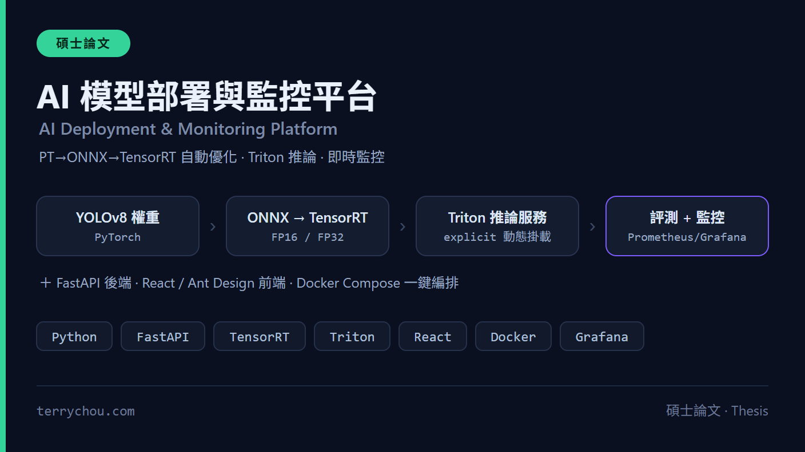
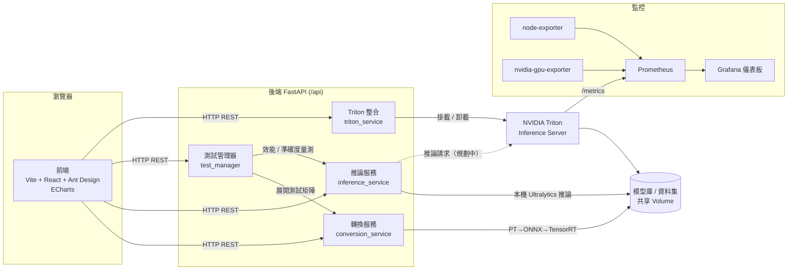

# AI-Deployment-Pipeline

> YOLO 模型自動化「轉換 → 部署 → 評測」平台：一鍵把 PyTorch 權重壓成 TensorRT 引擎、部署到 Triton，並產出多組態效能基準與即時 GPU 監控。

<p align="center"></p>

[](https://github.com/q86865511/AI-Deployment-Pipeline/actions/workflows/ci.yml)


<p align="center"></p>

🎥 **系統展示影片**：[YouTube 解說影片](https://youtu.be/e8TkImJPilg)

## 這是什麼

本專案是一套針對 YOLO 系列模型的**端到端模型部署與效能評測平台**。它把「模型格式轉換 → 推論服務部署 → 多組態基準測試 → 結果分析 → 資源監控」串成一條自動化管線，讓使用者透過網頁介面即可完成原本需要手動操作 TensorRT、Triton、Prometheus 的繁瑣流程。

典型情境:上傳一個 `YOLOv8n-Pose.pt`,勾選要測的精度(FP32 / FP16)與批次大小(1、2、4、8…),系統會自動把每一種組合轉成 ONNX 與 TensorRT 引擎、上架到 Triton 模型庫、在驗證資料集上跑準確度(mAP)與效能(延遲 / 吞吐量 / VRAM)量測,最後在前端以圖表呈現速度與準確度的權衡,並可匯出 PDF / Excel 報告。效能量測的執行位置與統計方式見「[實驗方法](#-實驗方法)」。

組成:

- **後端**:Python + FastAPI 非同步 API,負責轉換、推論、測試管理與 Triton 整合。
- **前端**:Vite + React 18 + Ant Design,搭配 ECharts 做結果可視化。
- **模型上架服務**:NVIDIA Triton Inference Server,以 explicit 模式動態掛載 / 卸載模型,負責模型的上架與生命週期管理;**效能量測目前走後端容器內的本機 Ultralytics 路徑,不經過 Triton 推論**(對照組見「實驗方法」)。
- **監控**:Prometheus 收集指標、Grafana 呈現儀表板,目前內建 4 個面板(CPU 使用率、記憶體使用率、GPU 負載、GPU VRAM 使用率);Triton 的 `/metrics` 已納入 Prometheus 抓取目標,但尚未做成 Grafana 面板。
- **編排**:Docker Compose,後端、Triton、GPU exporter 皆掛載 NVIDIA GPU。

## ✨ 技術亮點

- **PT → ONNX → TensorRT 自動轉換管線**：以 Ultralytics + ONNX + TensorRT 工具鏈,將 PyTorch 權重逐步轉為 ONNX、再編譯為 TensorRT 引擎,支援 FP32 / FP16 精度與指定批次大小,並自動生成 Triton 所需的 `config.pbtxt`。
- **多 batch × 多精度的基準測試矩陣**：自動展開「精度 × 批次大小」的組合矩陣(例如 2 精度 × 6 批次 = 12 組),對每組做重複量測並記錄平均值與標準差,輸出延遲、FPS、GPU 使用率、VRAM 等指標。
- **準確度與效能雙軌評估**：在驗證資料集上計算 mAP50 / mAP50-95,搭配效能量測,於前端以「速度 vs 準確度」帕累托前沿協助選型。
- **Triton 模型上架與生命週期管理**：以 `--model-control-mode=explicit` 動態掛載 / 卸載模型,自動產生 `config.pbtxt`,提供 HTTP / gRPC 與 metrics 端點。**效能量測走後端容器內的本機 Ultralytics 路徑,不經過 Triton 推論**;Triton 推論對照組為規劃中項目,詳見「實驗方法」。
- **GPU 與系統即時監控**：node-exporter(系統)、nvidia-gpu-exporter(GPU 利用率 / VRAM)與 Triton metrics 三路指標匯入 Prometheus,Grafana 自動載入儀表板(目前 4 個面板:CPU 使用率、記憶體使用率、GPU 負載、GPU VRAM 使用率;尚無 Triton 推論指標面板)。
- **近期安全加固**(見「已知限制」前的說明):
  - **CORS 來源改由環境變數注入**(`CORS_ORIGINS`),避免 `allow_origins=["*"]` 搭配憑證的風險。
  - **資料集 ZIP 安全解壓**:`safe_extract_zip()` 逐一驗證每個成員解壓後仍落在目標目錄內,防止 zip-slip 路徑穿越。
  - **Grafana 管理員密碼改為必填環境變數**(`GF_SECURITY_ADMIN_PASSWORD`),未設定時 Docker Compose 直接報錯,杜絕預設弱密碼。
  - **上傳端點路徑清洗**:資料集 ZIP 檔名與模型名稱一律先經 `app/utils/path_safety.sanitize_filename()`(`os.path.basename` ＋ 字元白名單)清洗,落地前再以 `os.path.commonpath` 複核仍在允許目錄內;對應的免 GPU 單元測試在 `backend/tests/test_path_safety.py`,已納入 CI。
  - **移除未使用的 flask 依賴**,縮小依賴面與攻擊面。
  - **後端相依升版**:`Pillow` 9.5.0 → 10.4.0、`aiohttp` 3.8.6 → 3.10.11、`python-multipart` 0.0.6 → 0.0.18、`onnx` 1.15.0 → 1.17.0、`requests` 2.31.0 → 2.32.4,均改為已修補既知 CVE 的保守相容版本。**此次升版僅經 `python -m compileall` 與免 GPU 單元測試驗證,未在具 GPU/TensorRT 的環境實跑轉換與推論路徑**,實際部署前請自行以完整相依回歸一次。
  - **前端依賴漏洞清零 ＋ 工具鏈現代化**:前端原為 Create React App(`react-scripts@5.0.1`),其依賴鏈帶有 65 個已知漏洞(含 3 critical、32 high)。已**遷移至 Vite**移除整條 `react-scripts` 鏈,並升級 `jspdf`、`axios`、`react-router-dom`、將 `xlsx` 換為 SheetJS 官方修正版,移除未使用的 `@ant-design/plots` / `recharts`。`npm audit --omit=dev` 遷移後一度為 0 漏洞,目前維持 **0 critical / 0 high**(隨上游新揭露的漏洞會有 low / moderate 項目浮現,以實跑結果為準)。

### 前端依賴安全與正式部署注意事項

- **依賴稽核**:前端 `npm audit --omit=dev --audit-level=moderate` 維持 0 critical / 0 high;升級依賴後請以 `npm run build` 與 `npm test`(Vitest)回歸。
- **CORS**:後端 `CORS_ORIGINS` 為逗號分隔的允許來源清單,正式部署務必改為實際前端網域,勿用萬用字元 `*`。
- **API 位址**:前端透過建置期環境變數 `VITE_API_URL` 注入後端位址(`.env` 中設定);未設定時退回 `http://localhost:8000`。實作集中在 `frontend/src/api/client.js`(共用 axios instance ＋ `API_BASE_URL` 常數),所有頁面都走這支,沒有硬編碼的後端位址;`docker-compose.yml` 以同名 build arg / 環境變數傳入。

## 🏗️ 架構

頂部 hero 圖呈現整體系統;下方 mermaid 聚焦資料流——前端呼叫 FastAPI `/api`,由轉換 / 推論 / 測試服務驅動 Triton 與模型庫,Prometheus 抓取 Triton 與 exporter 指標供 Grafana 視覺化。

> 圖中**虛線**代表**規劃中、尚未實作**的路徑:目前 Triton 只負責模型上架與生命週期管理,效能量測是在後端容器內以本機 Ultralytics 執行,沒有任何推論請求經過 Triton。



## 🚀 快速開始

> ⚠️ 本平台需要 **NVIDIA GPU** 並安裝 **NVIDIA Container Toolkit**;後端、Triton 與 GPU exporter 都會請求 GPU 資源。

### 前置需求

- Docker Desktop(Windows / macOS)或 Docker Engine(Linux)
- Docker Compose v2+
- NVIDIA GPU(CUDA 11.4+)、NVIDIA Container Toolkit
- 建議至少 16GB RAM 與 50GB 可用空間

### 1. 取得專案並設定環境變數

```bash
git clone https://github.com/q86865511/AI-Deployment-Pipeline
cd AI-Deployment-Pipeline
cp .env.example .env
```

編輯 `.env`,**至少**填入 Grafana 管理員密碼(必填,否則 Compose 會直接報錯):

```dotenv
GF_SECURITY_ADMIN_PASSWORD=your-strong-password
# 正式部署請把 CORS_ORIGINS 改成實際前端網域
CORS_ORIGINS=http://localhost:3000
```

### 2. 啟動

**Windows**:

```cmd
startup.bat
```

**Linux**:

```bash
chmod +x startup.sh
./startup.sh            # 完整啟動(會視需要重建基礎映像)
./startup.sh --quick   # 快速啟動(只改程式碼、不動依賴時)
```

或直接用 Docker Compose:

```bash
docker-compose build backend-base frontend-base
docker-compose up -d
```

### 3. 服務端點

| 服務 | URL | 說明 |
|------|-----|------|
| 主介面 | http://localhost:3000 | React 前端 |
| API 服務 | http://localhost:8000 | FastAPI 後端 |
| API 文檔 | http://localhost:8000/docs | Swagger UI |
| Grafana 監控 | http://localhost:3001 | 帳號 `admin`,密碼為 `.env` 中設定的 `GF_SECURITY_ADMIN_PASSWORD` |
| Prometheus | http://localhost:9090 | 指標查詢介面 |
| Triton(HTTP / gRPC / Metrics) | 8001 / 8002 / 8003 | 推論與指標端點 |

> 核心 API:`/api/models`、`/api/conversion`、`/api/inference`、`/api/benchmark`、`/api/triton`。

## 🔬 實驗方法

效能數字的解讀取決於「在哪一層量、量了幾次、怎麼統計」,以下如實記載目前的實作(對應
`backend/app/services/inference_service.py` 的 `_run_engine_benchmark` / `_run_general_benchmark`)。

| 項目 | 目前作法 |
|------|---------|
| 執行位置 | 後端容器內以 **Ultralytics `YOLO.predict()` in-process** 執行,**不經過 Triton**。Triton 只負責模型上架與 load / unload。 |
| 量測範圍 | `time.time()` 包住整個 `predict()` 呼叫,屬**含磁碟讀圖、前處理與 NMS 後處理的端到端管線延遲**,不是純 GPU kernel 時間。 |
| 預熱 | 正式量測前先以同一批影像跑 1 次 warmup(順帶檢查 engine 是否支援該 batch size)。 |
| 重複次數 | 每個「精度 × 批次大小」組態重複量測 `min(使用者輸入, MAX_BENCHMARK_ITERATIONS)` 次,上限預設 **10**,可用同名環境變數調整。結果檔的 `iterations` 為**實際執行次數**,`requested_iterations` 為使用者輸入值。 |
| 統計量 | 平均值、**樣本標準差(`np.std(..., ddof=1)`,n < 2 時記 0)**、最小值、最大值,並保留每次的原始值 `all_inference_times`。上述數值皆已除以 batch size,換算為**單張影像的平均延遲**;吞吐量為 `batch_size / 批次耗時`。 |
| 量測影像 | 從資料集目錄取圖時先 `sorted()` 再取前 `batch_size` 張,確保同一資料集在不同機器上取到相同影像;每次迭代重複使用同一批影像。 |

**已知的方法學限制**(尚未處理,列出以免誤讀數字):

- 量測迴圈未呼叫 `torch.cuda.synchronize()`,GPU 非同步執行可能使單次計時偏移;同檔其他路徑則有呼叫,語意尚未統一。
- 每組 n ≤ 10 且未做收斂性檢查,標準差僅供離散程度參考,未計信賴區間、未定義離群值處理規則。
- 量測對象是 Ultralytics `export(format="engine")` 產出的固定 shape `model.engine`;Triton 載入的是 `trtexec` 從 dynamic ONNX 建的 `model.plan`,兩者最佳化 profile 不同,**本頁數字不代表 Triton 服務路徑的效能**。
- 結果檔尚未記錄 GPU 型號 / 驅動 / CUDA / TensorRT 版本指紋,跨機器比較需自行補環境資訊。

## 🧪 測試

完整後端依賴(CUDA / TensorRT / Triton client)無法在一般 CI runner 上安裝,因此 CI(`.github/workflows/ci.yml`)採用**輕量守門**策略,在每次 push 到 `main` 與所有 PR 上執行:

- **後端(語法 / lint)**:`python -m compileall`(語法檢查)＋ Ruff 真實錯誤子集(`E9, F63, F7, F82`,設定見 `backend/ruff.toml`)。
- **後端(單元測試)**:`pytest`——純邏輯模組(`app/services/{model_tasks,comparison,combinations}.py`)的 characterization 測試,加上上傳路徑清洗(`app/utils/path_safety.py`,驗證 `../` 會被擋)的安全測試;只依賴 `pydantic`,免 GPU / TensorRT。
- **前端**:`npm ci` ＋ `npm test`(Vitest 單元測試)＋ `npm run build`(Vite production build);純函式 util(`src/utils/*`)以 Vitest 做 characterization 測試。

本機重現:

```bash
# 後端守門 + 純邏輯單元測試
cd backend
python -m compileall -q app
pip install ruff==0.15.12 && ruff check app/
pip install pytest pydantic==2.4.2 && python -m pytest tests/ -q

# 前端 build + util 測試
cd frontend
npm ci
npm test          # Vitest 單元測試
npm run build     # Vite production build
```

> 純邏輯單元測試(免 GPU)已納入 CI;需 GPU / TensorRT 的端到端推論 / 轉換整合測試仍須在具 GPU 的環境手動執行,未納入公開 CI。

## ⚠️ 已知限制

- **硬性依賴 NVIDIA GPU**:轉換、推論與 GPU 監控皆需 NVIDIA GPU + CUDA + TensorRT,純 CPU 環境無法完整運作。
- **Triton 尚未進入推論路徑**:Triton 目前只做模型上架與 load / unload,所有效能數字都來自後端容器內的本機 Ultralytics 推論;「本機 in-process vs Triton 服務」對照組為規劃中項目,詳見「實驗方法」。
- **CI 為輕量守門 ＋ 純邏輯單元測試**:完整依賴無法在公開 CI 安裝,故 CI 做前端 Vitest＋Vite build、後端語法 / lint＋純邏輯 pytest;不涵蓋需 GPU 的端到端整合或推論路徑。
- **後端 lint 尚未全面清理**:Ruff 目前只擋真實錯誤子集,風格問題待後續清理。
- **前端 bundle 尚未切分**:主 chunk 約 3.3MB(antd / echarts / xlsx / jspdf 同包),功能正常但首次載入偏大,後續可用動態 `import()` 或 `manualChunks` 優化。
- **部分巨型服務檔待重構(進行中)**:已將可測的純邏輯(task 對應、效能比較、組合生成)抽成獨立模組並補單元測試;`inference_service.py`(約 1.7k 行)、`test_manager.py`、`conversion_service.py` 的 GPU / subprocess 重型程式碼仍偏大,需在具 GPU 的環境能行為驗證後再安全拆分。
- **資料集約束**:標準化測試案例要求驗證集圖片數可被所有批次大小整除(例如 2304 張),否則部分組合無法整批推論。

## 📄 授權

本專案採用 MIT 授權,詳見 [LICENSE](LICENSE)。
