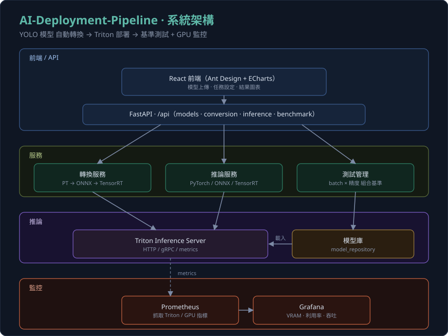
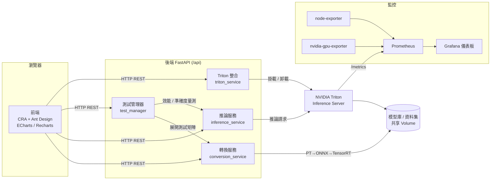

# AI-Deployment-Pipeline

> YOLO 模型自動化「轉換 → 部署 → 評測」平台：一鍵把 PyTorch 權重壓成 TensorRT 引擎、部署到 Triton，並產出多組態效能基準與即時 GPU 監控。

[](https://github.com/q86865511/AI-Deployment-Pipeline/actions/workflows/ci.yml)


<p align="center"></p>

🎥 **系統展示影片**：[YouTube 解說影片](https://youtu.be/e8TkImJPilg)

## 這是什麼

本專案是一套針對 YOLO 系列模型的**端到端模型部署與效能評測平台**。它把「模型格式轉換 → 推論服務部署 → 多組態基準測試 → 結果分析 → 資源監控」串成一條自動化管線，讓使用者透過網頁介面即可完成原本需要手動操作 TensorRT、Triton、Prometheus 的繁瑣流程。

典型情境:上傳一個 `YOLOv8n-Pose.pt`,勾選要測的精度(FP32 / FP16)與批次大小(1、2、4、8…),系統會自動把每一種組合轉成 ONNX 與 TensorRT 引擎、部署到 Triton、在驗證資料集上跑準確度(mAP)與效能(延遲 / 吞吐量 / VRAM)量測,最後在前端以圖表呈現速度與準確度的權衡,並可匯出 PDF / Excel 報告。

組成:

- **後端**:Python + FastAPI 非同步 API,負責轉換、推論、測試管理與 Triton 整合。
- **前端**:Create React App + Ant Design,搭配 ECharts / Recharts 做結果可視化。
- **推論服務**:NVIDIA Triton Inference Server,以 explicit 模式動態掛載 / 卸載模型。
- **監控**:Prometheus 收集指標、Grafana 呈現儀表板,涵蓋 CPU / 記憶體 / GPU 利用率 / VRAM 與 Triton 推論指標。
- **編排**:Docker Compose,後端、Triton、GPU exporter 皆掛載 NVIDIA GPU。

## ✨ 技術亮點

- **PT → ONNX → TensorRT 自動轉換管線**：以 Ultralytics + ONNX + TensorRT 工具鏈,將 PyTorch 權重逐步轉為 ONNX、再編譯為 TensorRT 引擎,支援 FP32 / FP16 精度與指定批次大小,並自動生成 Triton 所需的 `config.pbtxt`。
- **多 batch × 多精度的基準測試矩陣**：自動展開「精度 × 批次大小」的組合矩陣(例如 2 精度 × 6 批次 = 12 組),對每組做重複量測並記錄平均值與標準差,輸出延遲、FPS、GPU 使用率、VRAM 等指標。
- **準確度與效能雙軌評估**：在驗證資料集上計算 mAP50 / mAP50-95,搭配效能量測,於前端以「速度 vs 準確度」帕累托前沿協助選型。
- **Triton 生產級部署**：以 `--model-control-mode=explicit` 動態掛載 / 卸載模型,提供 HTTP / gRPC 推論與 metrics 端點。
- **GPU 與系統即時監控**：node-exporter(系統)、nvidia-gpu-exporter(GPU 利用率 / VRAM)與 Triton metrics 三路指標匯入 Prometheus,Grafana 自動載入儀表板。
- **近期安全加固**(見「已知限制」前的說明):
  - **CORS 來源改由環境變數注入**(`CORS_ORIGINS`),避免 `allow_origins=["*"]` 搭配憑證的風險。
  - **資料集 ZIP 安全解壓**:`safe_extract_zip()` 逐一驗證每個成員解壓後仍落在目標目錄內,防止 zip-slip 路徑穿越。
  - **Grafana 管理員密碼改為必填環境變數**(`GF_SECURITY_ADMIN_PASSWORD`),未設定時 Docker Compose 直接報錯,杜絕預設弱密碼。
  - **移除未使用的 flask 依賴**,縮小依賴面與攻擊面。

## 🏗️ 架構

頂部 hero 圖呈現整體系統;下方 mermaid 聚焦資料流——前端呼叫 FastAPI `/api`,由轉換 / 推論 / 測試服務驅動 Triton 與模型庫,Prometheus 抓取 Triton 與 exporter 指標供 Grafana 視覺化。



## 🚀 快速開始

> ⚠️ 本平台需要 **NVIDIA GPU** 並安裝 **NVIDIA Container Toolkit**;後端、Triton 與 GPU exporter 都會請求 GPU 資源。

### 前置需求

- Docker Desktop(Windows / macOS)或 Docker Engine(Linux)
- Docker Compose v2+
- NVIDIA GPU(CUDA 11.4+)、NVIDIA Container Toolkit
- 建議至少 16GB RAM 與 50GB 可用空間

### 1. 取得專案並設定環境變數

```bash
git clone https://github.com/q86865511/AI-Deployment-Pipeline
cd AI-Deployment-Pipeline
cp .env.example .env
```

編輯 `.env`,**至少**填入 Grafana 管理員密碼(必填,否則 Compose 會直接報錯):

```dotenv
GF_SECURITY_ADMIN_PASSWORD=your-strong-password
# 正式部署請把 CORS_ORIGINS 改成實際前端網域
CORS_ORIGINS=http://localhost:3000
```

### 2. 啟動

**Windows**:

```cmd
startup.bat
```

**Linux**:

```bash
chmod +x startup.sh
./startup.sh            # 完整啟動(會視需要重建基礎映像)
./startup.sh --quick   # 快速啟動(只改程式碼、不動依賴時)
```

或直接用 Docker Compose:

```bash
docker-compose build backend-base frontend-base
docker-compose up -d
```

### 3. 服務端點

| 服務 | URL | 說明 |
|------|-----|------|
| 主介面 | http://localhost:3000 | React 前端 |
| API 服務 | http://localhost:8000 | FastAPI 後端 |
| API 文檔 | http://localhost:8000/docs | Swagger UI |
| Grafana 監控 | http://localhost:3001 | 帳號 `admin`,密碼為 `.env` 中設定的 `GF_SECURITY_ADMIN_PASSWORD` |
| Prometheus | http://localhost:9090 | 指標查詢介面 |
| Triton(HTTP / gRPC / Metrics) | 8001 / 8002 / 8003 | 推論與指標端點 |

> 核心 API:`/api/models`、`/api/conversion`、`/api/inference`、`/api/benchmark`、`/api/triton`。

## 🧪 測試

完整後端依賴(CUDA / TensorRT / Triton client)無法在一般 CI runner 上安裝,因此 CI(`.github/workflows/ci.yml`)採用**輕量守門**策略,在每次 push 到 `main` 與所有 PR 上執行:

- **後端**:`python -m compileall`(語法檢查)＋ Ruff 真實錯誤子集(`E9, F63, F7, F82`,設定見 `backend/ruff.toml`)。
- **前端**:`npm ci` ＋ `npm run build`(CRA production build)。

本機重現:

```bash
# 後端守門
cd backend
python -m compileall -q app
pip install ruff==0.15.12 && ruff check app/

# 前端 build
cd frontend
npm ci
CI=false npm run build
```

> 後端另含 `pytest` 依賴,完整單元測試需在具 GPU / TensorRT 的環境執行,目前未納入 CI。

## ⚠️ 已知限制

- **硬性依賴 NVIDIA GPU**:轉換、推論與 GPU 監控皆需 NVIDIA GPU + CUDA + TensorRT,純 CPU 環境無法完整運作。
- **CI 僅為輕量守門**:完整依賴無法在公開 CI 安裝,故 CI 僅做前端 build 與後端語法 / lint 檢查,不涵蓋端到端整合或 GPU 路徑。
- **前端 lint 與後端 lint 尚未全面清理**:CRA build 以 `CI=false` 容忍既有 ESLint warning;Ruff 目前只擋真實錯誤子集,風格問題待後續清理。
- **部分巨型服務檔待重構**:`inference_service.py`(約 1.7k 行)、`test_manager.py`、`conversion_service.py` 等檔案偏大,後續會拆分以利維護與測試。
- **資料集約束**:標準化測試案例要求驗證集圖片數可被所有批次大小整除(例如 2304 張),否則部分組合無法整批推論。

## 📄 授權

本專案採用 MIT 授權,詳見 [LICENSE](LICENSE)。
